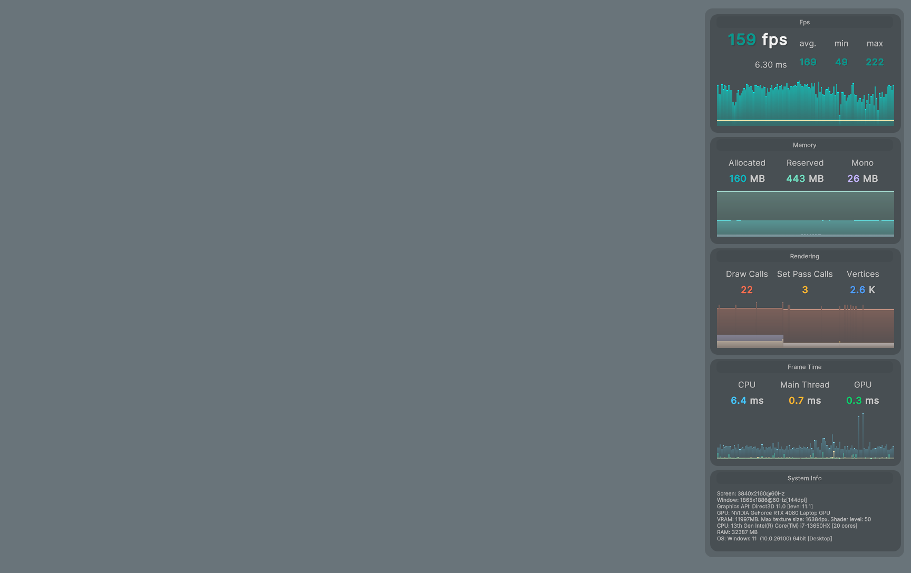

# UniStats
A simple fps / stats monitor based on UIToolkit.

You can swap fps / memory data source.
And you can add your own modules to the stats viewer by implementing the class based on `ModuleBase`.

## Installation
1. Open the Unity Package Manager
2. Click the + button
3. Select "Add package from git URL..."
4. Enter `https://github.com/witalosk/UniStats.git?path=Packages/com.witalosk.unistats`

## Usage
1. Add `UniStats` prefab to your scene.
2. That's all!

## Environment
- Unity 2021 or later.
  - I have not tested the operation of earlier versions.
- Windows (DirectX)
  - I have not confirmed operation outside of this environment.

## Modules
- FPS Module
- Memory Module
- Rendering Module
- Frame Time Module
  - Only works in Unity 2022 or later.

## References
- [Graphy](https://github.com/Tayx94/graphy)
